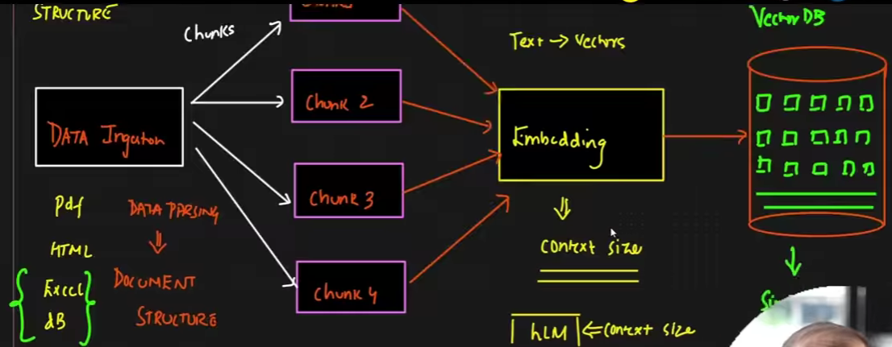
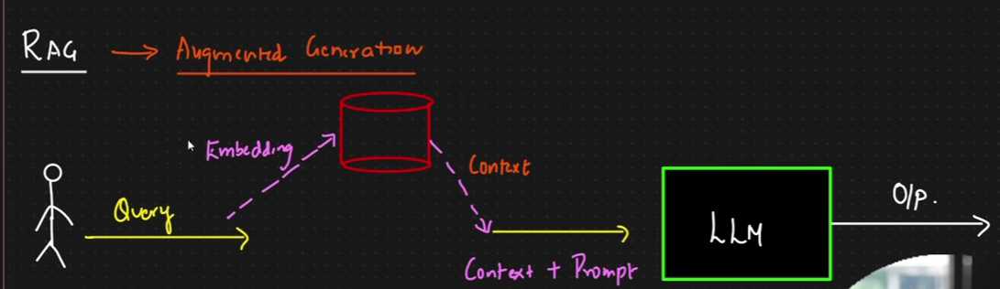
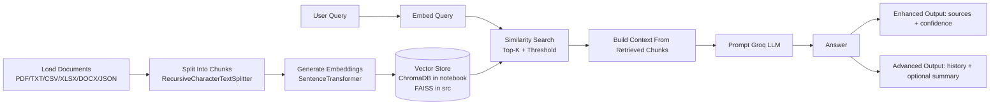
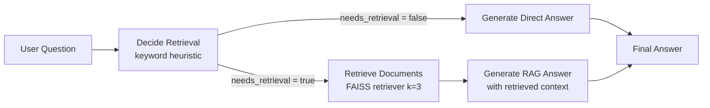
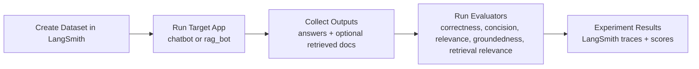

# RAG Pipeline

Retrieval-Augmented Generation (RAG) project using LangChain, Sentence Transformers, and Groq LLM, with experiments in notebooks and a modular Python implementation in `src/`.

## What This Repo Contains

- Multi-format document loading (PDF, TXT, CSV, XLSX, DOCX, JSON)
- Text chunking and embedding generation (`all-MiniLM-L6-v2` by default)
- Vector search pipelines
  - Notebook workflow: ChromaDB (`data/vector_store/`)
  - `src/` workflow: FAISS (`faiss_store/` by default at runtime)
- RAG query answering with Groq (`simple`, `enhanced`, `advanced` patterns in notebook)
- Agentic RAG workflow with LangGraph (`decide -> retrieve -> generate`) in `agenticrag/agenticrag.ipynb`
- RAG and chatbot evaluation with LangSmith in `rag_evaluation.ipynb`

## Actual Project Structure

```text
RAG/
├── README.md
├── requirements.txt
├── rag_evaluation.ipynb
├── data/
│   ├── pdf/
│   ├── text_files/
│   │   ├── machine_learning.txt
│   │   ├── python_intro.txt
│   │   └── sample1.txt
│   └── vector_store/
│       ├── chroma.sqlite3
│       └── f3828d17-731b-4d23-9234-12a3b06f22f2/
├── agenticrag/
│   └── agenticrag.ipynb
├── notebooks/
│   ├── document.ipynb
│   └── rag_pipeline.ipynb
└── src/
   ├── __init__.py
   ├── data_loader.py
   ├── embeddings.py
   ├── search.py
   └── vectorstore.py
```

## Pipeline Images




## RAG Flow (Based on `rag_pipeline.ipynb`)



## Agentic RAG Flow (Based on `agenticrag/agenticrag.ipynb`)

The agentic notebook builds a conditional LangGraph pipeline with a typed state:

- `question`
- `documents`
- `answer`
- `needs_retrieval`

Flow used in the notebook:



## RAG Evaluation Flow (Based on `rag_evaluation.ipynb`)

This notebook evaluates both a basic chatbot and a RAG bot using LangSmith experiments.

Main evaluation metrics used:

- Correctness (vs reference answer)
- Concision (response length check)
- Relevance (response vs question)
- Groundedness (response vs retrieved docs)
- Retrieval relevance (retrieved docs vs question)



## Quick Start

1. Create and activate environment

```bash
python -m venv .venv
.venv\Scripts\activate
```

2. Install dependencies

```bash
pip install -r requirements.txt
```

3. Add `.env` in project root

```env
GROQ_API_KEY=your_groq_api_key_here
OPENAI_API_KEY=your_openai_api_key_here
LANGSMITH_API_KEY=your_langsmith_api_key_here
LANGSMITH_TRACING=true
```

4. Run notebook pipelines

```bash
jupyter notebook notebooks/rag_pipeline.ipynb
jupyter notebook agenticrag/agenticrag.ipynb
jupyter notebook rag_evaluation.ipynb
```

## Minimal `src/` Usage

```python
from src.data_loader import load_all_documents
from src.vectorstore import FaissVectorStore
from src.search import RAGSearch

docs = load_all_documents("data")

store = FaissVectorStore("faiss_store")
store.build_from_documents(docs)

rag = RAGSearch(persist_dir="faiss_store")
answer = rag.search_and_summarize("What is attention mechanism?", top_k=3)
print(answer)
```

## Notes

- `notebooks/rag_pipeline.ipynb` demonstrates Simple, Enhanced, and Advanced RAG flows.
- `agenticrag/agenticrag.ipynb` demonstrates Agentic RAG with LangGraph conditional routing.
- `rag_evaluation.ipynb` demonstrates chatbot + RAG evaluation workflows with LangSmith.
- `src/` modules implement a runnable FAISS-based pipeline.
- ChromaDB artifacts currently exist under `data/vector_store/` from notebook workflow.
- Agentic notebook uses OpenAI chat + embeddings and an in-memory FAISS retriever built from sample texts.
